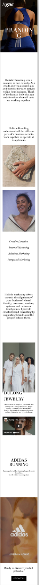

# Procesverslag
Markdown is een simpele manier om HTML te schrijven.  
Markdown cheat cheet: [Hulp bij het schrijven van Markdown](https://github.com/adam-p/markdown-here/wiki/Markdown-Cheatsheet).

Nb. De standaardstructuur en de spartaanse opmaak van de README.md zijn helemaal prima. Het gaat om de inhoud van je procesverslag. Besteedt de tijd voor pracht en praal aan je website.

Nb. Door *open* toe te voegen aan een *details* element kun je deze standaard open zetten. Fijn om dat steeds voor de relevante stuk(ken) te doen.

## Jij

uitwerken voor kick-off werkgroep

### Auteur:
Stephanie de Vilder

#### Je startniveau:
blauw/rood

#### Je focus:
surface plane
 

## Je website

uitwerken voor kick-off werkgroep

### Je opdracht:
file:///Users/Stephanie/OneDrive%20-%20HvA/CMD%20jaar%201/CMD%20jaar%202/frontend/basiswebsite/index.html

#### Screenshot(s) van de eerste pagina (small screen): 
home page 

#### Screenshot(s) van de tweede pagina (small screen):
second page 

 

## Breakdownschets (week 1)

uitwerken na afloop 2e werkgroep

### de hele pagina: 

### dynamisch deel (bijv menu): 

### wellicht nog een dynamisch deel (bijv filter): 

## Voortgang 1 (week 2)

uitwerken voor 1e voortgang

### Stand van zaken
Tijdens de eerste 2 weken moest ik best wel inkomen weer. Ik was veel stof vergeten uit jaar 1 en hierdoor kwam ik moeizaam opgang.

### Agenda voor meeting
samen met je groepje opstellen

| student 1 (ik)     | student 2          | student 3    | student 4        |
| ---            | ---                | ---          | ---              |
| element wil niet in het midden | en dit             | en ik dit    | en dan ik dat    |
|  | dit als er tijd is | nog een punt | dit wil ik zeker |
|             | ...                | ...          | ...              |

### Verslag van meeting
hier na afloop snel de uitkomsten van de meeting vastleggen

- Ik heb hulp gekregen met het centreren van een een element wat steeds niet lukte en verder was ik wel lekker bezig en had ik niet veel vragen omdat ik deze in de lessen al had opgelost.
- Volgende week beter gidhub bijhouden.

## Voortgang 2 (week 3)

uitwerken voor 2e voortgang

### Stand van zaken
Ik heb mijn eerste pagina zo goed als af. Ik moet nog een paar kleine puntjes op de i zetten en een hamburger menu maken. Ik ben nu bezig gegaan met de tweede pagina maar wil misschien toch eerst de eerste pagina helemaal afmaken.

### Agenda voor meeting
samen met je groepje opstellen

| student 1      | student 2          | student 3    | student 4        |
| ---            | ---                | ---          | ---              |
| Ik wil dat mijn content langzaam verschijnt wanneer je naar beneden scrolt. Is dit mogelijk zonder JavaScript? | en dit             | en ik dit    | en dan ik dat    |
|  | dit als er tijd is | nog een punt | dit wil ik zeker |
| ...            | ...                | ...          | ...              |

### Verslag van meeting
hier na afloop snel de uitkomsten van de meeting vastleggen

- Moeilijke functie die ik wou toevoegen laten vallen want is niet prioriteit en te lastig voor me.
- Code opschonen voordat ik aan de tweede pagina ga beginnen.
- Opdrachten van volgende week goed maken want handig voor leuke interacties.

## Toegankelijkheidstest (week 4)

uitwerken na test in 8e voortgang

### Bevindingen
Lijst met je bevindingen die in de test naar voren kwamen:
 
 SCREENREADER:
 - Screenreader leest de navigatie links die buiten het zicht staan voor, hier kan je helaas niet op klikken.
 - Read more buttons veranderen.
 - Alt tekst bij images invullen.
 
 Bril 1: Peripheral Field Loss:
 -	Email adress input veld lastig te lezen door contrast.
 
 Bril 2: Low contrast:
 -	Email address input lastig te lezen.
 -	We respect your privacy ook low contrast lasting te lezen.
 
 Bril 3: Blur/glare:
-	Formulier email input niet te lezen.
-	Privacy tekst niet te lezen.
-	Hamburger menu streepjes beter als het wit is.
 
 De rest van de testen gingen allemaal zonder probleem. Dit komt doordat mijn buttons groot genoeg zijn en de contrasten goed zijn.

#### Screenreader leest linkjes die niet te zien zijn.
Screenreader leest de navigatie links die buiten het zicht staan voor, hier kan je helaas niet op klikken.
 

Oplossing: Hier een omschrijving van hoe het opgelost kan worden (met indien nodig een afbeelding)

#### contrast te laag (input veld) 
Email adress input veld lastig te lezen door contrast. 
 

Oplosing: De grijze tekst iets donkerder makenzodat het contrast groter is. (met indien nodig een afbeelding)

#### privacy tekst lastig te lezen 
tekst "We respect your privacy..." ook low contrast dus lastig te lezen.  (met indien nodig een afbeelding)

Oplossing: Of ik moet de tekst wit maken zodat het minder in de achtegrond valt,
 of ik voeg een opasity toe aan de achtergrond image.    (met indien nodig een afbeelding)

#### Hamburger menu valt weg 
Hamburger menu streepjes zijn nu zwart en doordat alle andere content op dit stukje pagina wit is valt het een beetje weg als je zicht niet helemaal goed is. (met indien nodig een afbeelding)

Oplossing: Maak het hambuger menu wit zodat het beter opvalt. (met indien nodig een afbeelding)

## Voortgang 3 (week 4)

uitwerken voor 3e voortgang

### Stand van zaken
hier dit ging goed & dit was lastig (neem ook screenshots op van delen van je website en code)
 
 Ik liep even vast met de states omdat mijn hover state niet werkte doordat het op mobiel formaat is. Het leek toen even dat mijn andere states ook niet werkte maar dit is gelukkig uiteindelijk gelukt.
 Ik was erg blij met het hamburger menu die bijna helemaal goed werkt. Ik heb hier wel hulp bij gekregen want in mijn eentje lukte dit niet en was ik daar ook een tijdje mee aan het struggelen.
 Verder heb ik deze week vooral de puntjes op de i gezet voor mijn eerste pagina.
 
 To do:
 - Alle pixels omzetten in em.
 - 2e pagina maken.
 - surface plane plan maken: welke extra'tjes moet ik nog toevoegen.
 - formulier states nog toevoegen
 

### Agenda voor meeting
samen met je groepje opstellen

| student 1 (ik)      | student 2          | student 3    | student 4        |
| ---            | ---                | ---          | ---              |
|  | en dit             | en ik dit    | en dan ik dat    |
| ik wil dat wanneer je het hamburger menu openslaat je niet meer naar beneden kan scrollen verder op de pagina. dit is nog niet gelukt. | dit als er tijd is | nog een punt | dit wil ik zeker |
| ...            | ...                | ...          | ...              |

### Verslag van meeting
hier na afloop snel de uitkomsten van de meeting vastleggen

- punt 1
- punt 2
- nog een punt
- ...

## Eindgesprek (week 5)

uitwerken voor eindgesprek

### Stand van zaken
hier dit ging goed & dit was lastig (neem ook screenshots op van delen van je website en code)

### Screenshot(s)

hier screenshot(s) van je eindresultaat

## Bronnenlijst

continu bijhouden terwijl je werkt

Nb. Wees specifiek ('css-tricks' als bron is bijv. niet specifiek genoeg).

1. bron 1
2. bron 2
3. ...

